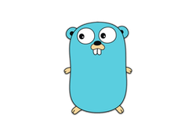

# Godash Documentation

<p align="center">
</img>
</p>

This documentation generated by [docuowl](https://github.com/docuowl/docuowl).

## How To Render Documentation?

1. Install [docuowl](https://github.com/docuowl/docuowl) from instructions in their repository.
2. Run this command:
   ```bash
   docuowl --input docs --output docs_html
   ```

# How To Serve Document?

1. Render documentation with instructions in upper section.
2. Install docker and docker-compose.
3. Run: `docker compose up -d`.
4. Server is accessible from [127.0.0.1:8080](http://127.0.0.1:8080).

# How To Refresh On Development?

1. For one in your current terminal run: `alias refresh="docker compose down; docuowl --input docs --output docs_html; docker compose up -d"`
2. After that, you can simply run `refresh` and refresh current structure documentation.
